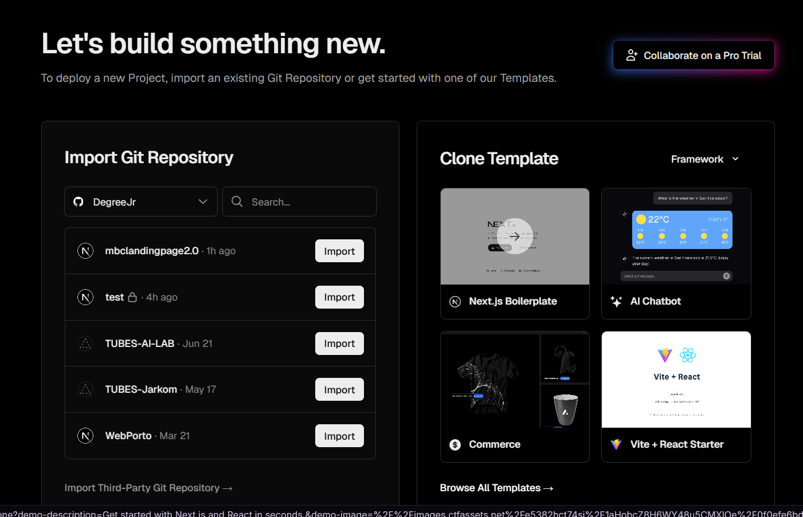
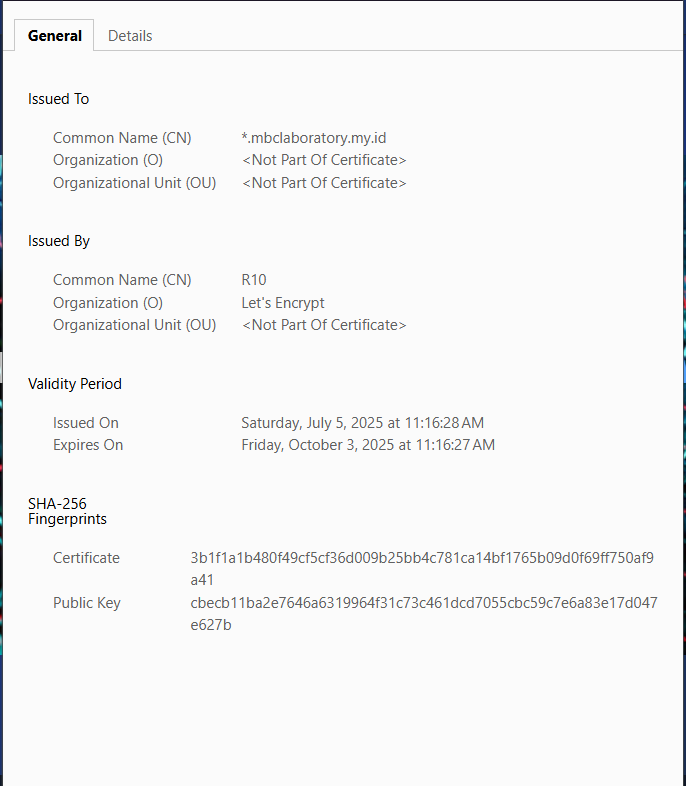
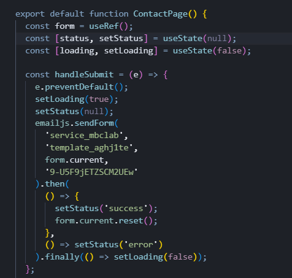

# MBC Laboratory Landing Page

The landing page is available at the following link 
---

## 📁 Project Structure

```
mbclandingpage2025/
├── public/                        # Static assets (images, icons, etc.)
├── src/
│   └── app/                       # Next.js app directory (App Router)
│       ├── layout.js              # Root layout for all pages
│       ├── globals.css            # Global styles (Tailwind, etc.)
│       ├── page.jsx               # Home page ("/")
│       ├── contact/
│       │   └── page.jsx           # Contact page ("/contact")
│       ├── developer/
│       │   └── page.jsx           # Developer page ("/developer")
│       ├── services/
│       │   └── page.jsx           # Services page ("/services")
│       ├── components/            # Reusable React components
│       │   ├── Navbar.jsx         # Navigation bar
│       │   ├── Footer.jsx         # Footer
│       │   ├── GoogleMap.jsx      # Google Maps embed component
│       └── favicon.ico            # Site favicon
├── package.json                   # Project dependencies and scripts
├── postcss.config.mjs             # PostCSS config
├── tailwind.config.js             # Tailwind CSS config (if present)
├── next.config.mjs                # Next.js config
├── README.md                      # Project documentation
└── ...
```

**Page Structure Overview:**
- `src/app/page.jsx` — Home page, includes hero carousel, intro, vision & mission, and preview sections.
- `src/app/contact/page.jsx` — Contact form, address, map, and contact info.
- `src/app/services/page.jsx` — List and description of lab services/domains.
- `src/app/developer/page.jsx` — Developer profile, skills, and contact links.
- `src/app/components/` — Shared UI components (Navbar, Footer, GoogleMap, etc.) used across pages.

---

## 🚀 Local Installation

1. **Clone the repository:**
   ```bash
   git clone https://github.com/DegreeJr/mbclandingpage2.0.git
   cd mbclandingpage2.0
   ```
2. **Install dependencies:**
   ```bash
   npm install
   ```
3. **Run the development server:**
   ```bash
   npm run dev
   ```
4. **Open your browser:**
   Visit [http://localhost:3000](http://localhost:3000)

---

## 🚢 Deployment

> **TODO:** Add deployment instructions for Vercel, Netlify, or your preferred platform.
>
> Example for Vercel:
> 1. Push your code to GitHub.
> 2. Connect your repo to [Vercel](https://vercel.com/)
<div align="center">
  <p>
      
  </p>
</div>
> 3. Deploy with default settings.
---

## 🔒 SSL Configuration

> 1. For Vercel, SSL is automatic.
> But we can see SSL certificate through website
<div align="center">
  <p>
      
  </p>
</div>
---

## ⚙️ Backend Configuration

> - We use EmailJS on the backend to integrate the contact form with email delivery functionality.
<div align="center">
  <p>
      
  </p>
</div>

---

_Contributions and feedback are welcome!_
